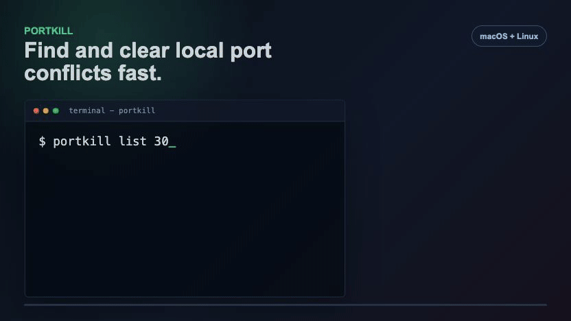

# PortKill

[](https://opensource.org/licenses/MIT)
[](https://github.com/mr-tanta/portkill/releases)
[](https://github.com/mr-tanta/portkill)
[](https://github.com/mr-tanta/homebrew-portkill)

PortKill is a Bash CLI for finding and terminating processes that bind local ports. It is built for developer workstations, servers, and container-heavy local environments where port conflicts need to be resolved quickly and safely.

<p align="center">
  
</p>

## Features

- Exact process detection for listening TCP ports and bound UDP ports
- Safe termination with SIGTERM first and SIGKILL escalation when needed
- Protected-process whitelist for system-critical processes
- Docker container detection and stop/kill support with `--docker`
- JSON output for automation
- Process tree view, real-time monitoring, history, and CSV/JSON exports
- Basic connection benchmarking for local and remote hosts
- macOS and Linux support with standard Unix tools

## Installation

### Homebrew

```bash
brew install mr-tanta/portkill/portkill
```

Homebrew 6.0+ requires third-party tap trust before short-name installs. If you have already tapped the repository and want to install or upgrade with `portkill`, trust only the PortKill formula first:

```bash
brew tap mr-tanta/portkill
brew trust --formula mr-tanta/portkill/portkill
brew install portkill
```

### AUR

```bash
yay -S portkill
# or
paru -S portkill
```

### Install Script

```bash
# Latest release
curl -sSL https://raw.githubusercontent.com/mr-tanta/portkill/main/install.sh | bash

# Specific release
curl -sSL https://raw.githubusercontent.com/mr-tanta/portkill/main/install.sh | bash -s v3.1.1

# Custom prefix, installs to /opt/portkill/bin/portkill
curl -sSL https://raw.githubusercontent.com/mr-tanta/portkill/main/install.sh | bash -s -- --prefix=/opt/portkill
```

### Manual Release Asset

```bash
curl -L https://github.com/mr-tanta/portkill/releases/latest/download/portkill -o portkill
chmod +x portkill
sudo mv portkill /usr/local/bin/
```

Debian and RPM packages are produced by the package workflow for releases. Use the assets on the GitHub release page when they are present.

## Requirements

Required:

- Bash 3.2+
- `ps`
- `kill`
- At least one port detector: `lsof`, `ss`, `netstat`, or `fuser`

Optional:

- `bc` for benchmark calculations
- `nc` or `telnet` for benchmarking
- Docker CLI for `--docker`

## Usage

```bash
# Kill processes on port 3000
portkill 3000

# Kill multiple ports or a range
portkill 3000 8080 9000
portkill 3000-3005

# Preview without killing
portkill --dry-run 3000
portkill kill --dry-run 3000

# Force kill with SIGKILL
portkill --force 3000

# Ask before each kill
portkill --interactive 8080
```

### Inspect Ports

```bash
# List processes on a port
portkill list 3000

# Detailed process info
portkill list --detailed 3000

# List all listening ports
portkill list

# Show process hierarchy
portkill tree --depth 5 3000
```

### Docker

```bash
# Include containers in listing
portkill --docker list 8080

# Stop containers and kill local processes bound to the port
portkill --docker 8080

# Preview Docker operations
portkill --docker --dry-run 8080
```

### JSON

```bash
portkill --json list 3000
portkill --docker --json list 8080
```

Process records use `"type": "process"`. Docker records use `"type": "container"` and include `container_id`, `name`, and `ports`.

### Monitoring, History, and Benchmarking

```bash
portkill monitor 3000 8080
portkill scan --security
portkill history
portkill history --analytics
portkill history --export json
portkill benchmark 3000 localhost 20
portkill benchmark 443 github.com
portkill menu
```

## Configuration

PortKill reads system defaults from `/etc/portkill/portkill.conf` when present, then user settings from `~/.portkill/config.conf`. User settings override system settings.

Supported config keys:

```bash
safe_mode=true
auto_confirm=false
verbose_mode=false
monitoring_interval=2
max_history_entries=1000
color_output=true
show_process_tree=true
```

Protected processes are listed in `~/.portkill/whitelist.conf`, one process name per line.

Logs and history are stored under `~/.portkill/`.

## Uninstall

```bash
# Install-script uninstall
curl -sSL https://raw.githubusercontent.com/mr-tanta/portkill/main/uninstall.sh | bash

# Remove user config as well
curl -sSL https://raw.githubusercontent.com/mr-tanta/portkill/main/uninstall.sh | bash -s -- --remove-config

# Homebrew
brew uninstall portkill
brew untap mr-tanta/portkill

# AUR
sudo pacman -R portkill
```

## Development

```bash
make test
./tests/test_portkill.sh
bash -n bin/portkill install.sh uninstall.sh
```

ShellCheck is used in CI when available.

## Package Channels

- Main repository: https://github.com/mr-tanta/portkill
- Homebrew tap: https://github.com/mr-tanta/homebrew-portkill
- AUR package: https://aur.archlinux.org/packages/portkill

## License

MIT License. See [LICENSE](LICENSE).
